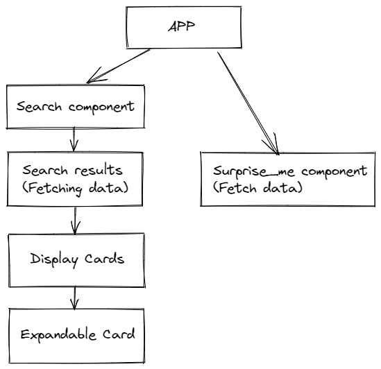
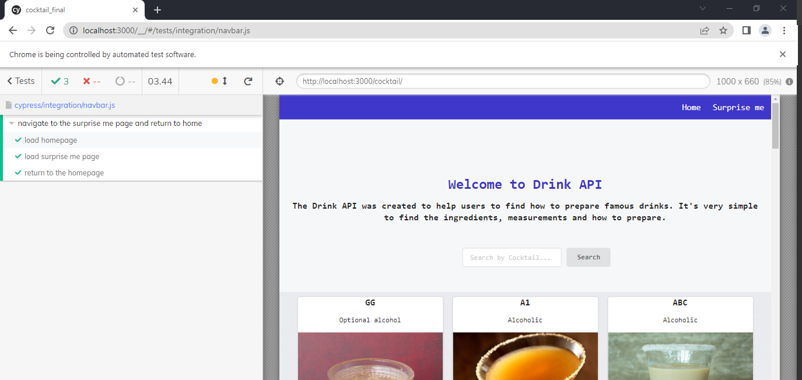
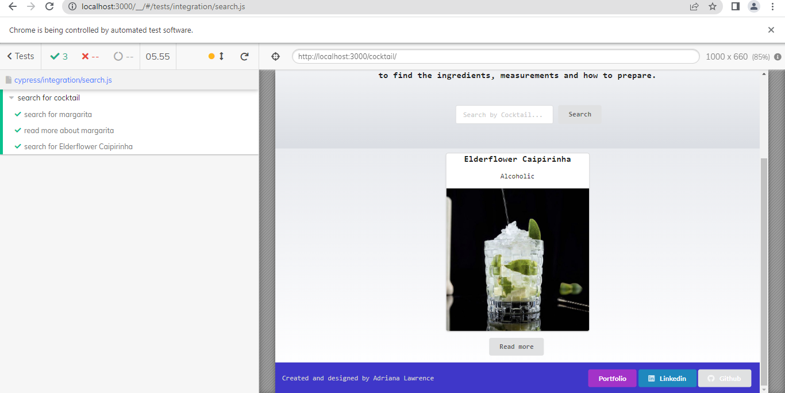

# Cocktail API

## Objective

Create a single page APP where users can search for a specific drink from an API and the result will be display on the screen.

You can access the website at https://drinobre.github.io/cocktail/

## Functionalities

Users will be able to interact with the API by:

- Searching by drink name
- Select a random cocktail using "Surprise me"

## Technical requirements

For this project, I will be using React.js to fetch the [Cocktail API](https://thecocktaildb.com/api.php).

#### Components Tree

#### Third-party Libraries

- [gh-pages](https://www.npmjs.com/package/gh-pageshttps://www.npmjs.com/package/gh-pages): use to deploy the cocktail page on Github.
- bootstrap: use to create the modals on the homepage.
- semantic-ui: use to style the components.

## Implementation Plan

Initiate React and Structure Folder convention

- Init React (npx create-react-app <react-app-name>)
- Create the folder Components > App and add the app files automatically created by React
- Change the file location for APP and image in the import
- Test the APP (npm start)
  

Creating components

- Create separate folders for each component, which will be rendered on the main APP (for example, buttons, display ...)
- Create the index.js file into each component, which they will handle a function containing a return in JSX format.
- `Note: the return must be inside a 
 or <> tag`.
  

Creating custom Hook

  
- Create a folder called Hook to add the custom hooks.
- It's best practice to call the custom hook use<i>HookName</i>. in order to follow the same rule as useState, useReducer (...)

  

Link pages using Link and Routes
  
  
- Install the [React Router](https://reactrouter.com/docs/en/v6/getting-started/installation) as a dependence > module npm install react-router-dom@6
- index.js:
  import { BrowserRouter } from "react-router-dom" and wrap up teh app on <BrowserRouter> instead of <React.StrictMode>. Otherwise, the App wouldn't render using the Routes and you can use on the APP file.
- app.js:
  import Link, Routes and Route from react-router-dom;

Use of Semantic UI React
  
  
- install the [Semantic Ui React](https://react.semantic-ui.com/usage/) > npm install semantic-ui-react semantic-ui-css;
- add import "semantic-ui-css/semantic.min.css" on the main index.js file;

Use of Modal

- install [React Bootstrap](https://react-bootstrap.github.io/components/modal/) > npm install react-bootstrap bootstrap@5.1.3;
- Note: make sure to add the [bootstrap/dist/css/bootstrap.min.css](https://react-bootstrap.github.io/getting-started/introduction/#css) for styling.

Typescript

- install [Typescript](https://www.typescriptlang.org/download) > npm install typescript --save-dev;
- Compile > npx tsc.
- Ps. when running the script test and have a ts dependence. The script will create a tsconfig.json file.

Cypress

- install [Cypress](https://docs.cypress.io/guides/getting-started/installing-cypress) > npm install cypress --save-dev;
- open it using npx cypress open (best to add scripts to package.json)
- Ps. when running the script test and have a ts dependence. The script will create a tsconfig.json file.
- In order to run the tests in Cypress (using localhost) you must have the app running on local host first.

## Learnings and Challenges

- Create custom Hook to Fetch data;
- Use of Routes (multiple pages APP);
- How to save an image on README file (format SVG or add the image on File);
- When mapping the array make sure to add the data fetched and the name of the const. For example, data.drinks.map();
- Import the semantic UI on the main index.js file;
- [Bug on semantic UI](https://github.com/Semantic-Org/Semantic-UI-React/issues/4287). After removing the additional ";" from node/modules make sure you do npm i otherwise there wouldn't be any update.
- Implement modals
  -- The documentation doesn't mentioned about what you have to import for the css to work. Therefore, I didn't import 'bootstrap/dist/css/bootstrap.min.css' for the style and the content was rendered on the bottom of the page without any style.
- Overwrite the SemanticUI font: you have to provide an id to the h1 to h4. The more specific the CSS selector > is the priority.
- Use of the tag <Headers> when creating pages;
- Aligning the cards using css. I was justify-content: space-between to align the cards but when the value on the last row was 2 cards they were displayed as first and last card. Therefore, I have used justify-content: space-between and justify-content: center on the container-multiple-cards.

## References

- https://thecocktaildb.com/api.php
- https://beta.reactjs.org/
- https://www.npmjs.com/package/gh-pages
